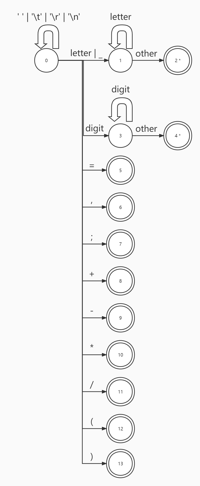

# 实验一：词法分析

## 实验概述

### 实验目的

使用自动机的写法实现一个简单的、特定的词法分析器。

### 词法规则

具体要实现的词法规则如下:

|   类别    |       正则表达式       |
| :-------: | :--------------------: |
|    int    |          int           |
|  return   |         return         |
|     =     |           =            |
|     ,     |           ,            |
| Semicolon |           ;            |
|     +     |           +            |
|     -     |           -            |
|     *     |           *            |
|     /     |           /            |
|     (     |           (            |
|     )     |           )            |
|    id     | \[a-zA-Z_\]\[a-zA-Z\]* |
| IntConst  |        \[0-9\]+        |

词法单元间的空白字符（包括$' ', '\t', '\r', '\n'$）需忽略。

### 输入/输出

程序读入下面的文件

```
data/in
├── coding_map.csv      # 码点文件
└── input_code.txt      # 输入的代码
```

生成下面的文件

```
data/out
├── old_symbol_table.txt    # 符号表
└── token.txt               # 词法单元列表
```

`data/std` 目录下存放同名的参考文件

## 框架介绍

### Token: 词法单元

一个词法单元包括两个私有属性，词法单元的类型，词法单元代表的文本

```java
class Token {
    private TokenKind kind;
    private String text;
}
```

对于大部分简单的词法单元而言，并不需要保存词法单元代表的文本。在这种情况下，将此 `Token` 的 `text` 设置为 `""` (空字符串)，而不是 `null`。

构造这两种 `Token`，有两个静态方法以供使用：

```java
class Token {
    public static Token simple(TokenKind kind) {
        return new Token(kind, "");
    }

    public static Token normal(TokenKind kind, String text) {
        return new Token(kind, text);
    }
}
```

### TokenKind: 词法单元类别

一般而言，词法单元的类别实现为一枚举。

但本实验的实现方法为，从一个文件中读入所有可能的词法单元。

**coding_map.txt**

```
1 int
2 return
3 =
4 ,
5 Semicolon
6 +
7 -
8 *
9 /
10 (
11 )
51 id
52 IntConst
```

词法单元类别设计如下：

```java
class TokenKind {
    private String id;
    private int code;
}
```

使用某个词法单元类别的名字（即`id`）来唯一标识该类别，而将所谓码点（`code`）作为词法单元类别的附加信息，仅供参考使用。

鉴于使用字符串作为唯一标识符有极大的因为拼写错误而出错的可能，在编译器运行时会从 `coding_map.txt` 中读入所有可能的词法单元类别标识符，然后在每次构造词法单元类别时进行检查：

```java
class TokenKind {
    public static TokenKind fromString(String id) {
        // 检查 id 是否被允许使用 (即是否在 coding_map.txt 中有定义)
        if (allowed == null || !allowed.containsKey(id)) {
            throw new RuntimeException("Illegal Identifier");
        }

        return allowed.get(id);
    }

    // 禁止外界构造新的 TokenKind
    private TokenKind(String id, int code) {
        // ...
    }
}
```

同时，重载参数类型为字符串的`simple` 和 `normal` 方法：

```java
class Token {
    public static Token simple(String tokenKindId) {
        return simple(TokenKind.fromString(tokenKindId));
    }

    public static Token normal(String tokenKindId, String text) {
        return normal(TokenKind.fromString(tokenKindId), text);
    }
}
```

### SymbolTable: 符号表

存放条目 `SymbolTableEntry` ，并提供相关方法

```java
class SymbolTable {
    public SymbolTableEntry get(String text) { ... }
    public SymbolTableEntry add(String text) { ... }
    public boolean has(String text) { ... }
    private Map<String, SymbolTableEntry> getAllEntries() { ... }
}
```

### SymbolTableEntry: 符号表条目

条目含有两个属性，符号的文本表示与符号的变量类型

```java
class SymbolTableEntry {
	private final String text;
    private SourceCodeType type;
}
```

其中由于该实验源语言中只有 int 变量，源语言变量的类型 `SourceCodeType` 枚举仅含`int`

```java
public enum SourceCodeType {
    // 我们的源语言中只有 int 变量, 对应到 RISC-V 中的 32 位有符号整数类型.
    Int
}
```

## 自动机设计

根据词法规则设计状态转移图如图所示：

其中带 `*` 的接受状态代表需回退一个字符。



## 代码设计

`main` 程序中与词法分析相关的代码：

```java
		// 构建符号表以供各部分使用
        TokenKind.loadTokenKinds();
        final var symbolTable = new SymbolTable();

        // 词法分析
        final var lexer = new LexicalAnalyzer(symbolTable);
        lexer.loadFile(FilePathConfig.SRC_CODE_PATH);
        lexer.run();
        lexer.dumpTokens(FilePathConfig.TOKEN_PATH);
        final var tokens = lexer.getTokens();
        symbolTable.dumpTable(FilePathConfig.OLD_SYMBOL_TABLE);
```

构建了一个空符号表，加载源代码，进行词法分析，并导出词法单元列表与符号表至文本文档。

### 词法分析器: LexicalAnalyzer

符号表与词法单元列表，在 `run` 方法中得到填充。

```java
public class LexicalAnalyzer {
	// 符号表
    private final SymbolTable symbolTable;
    // 词法单元列表
    private final List<Token> tokens = new LinkedList<>();
}
```

#### 加载文件: loadFile

加载源代码未实现缓冲区，直接读入所有字符并创建迭代器。

```java
	public void loadFile(String path) {
        // 直接读入文本文件中所有字符并创建StringCharacterIterator
        iterator = new StringCharacterIterator(FileUtils.readFile(path));
    }
```

#### 词法分析过程: run

大致分为三个部分：状态转移、拼接字符/数字、填充词法单元表/符号表。

执行完成后，所有此法单元存放于列表 `token` ，符号存于 `symbolTable` 。

```java
	/**
     * 执行词法分析, 准备好用于返回的 token 列表 <br>
     * 需要维护实验一所需的符号表条目, 而得在语法分析中才能确定的符号表条目的成员可以先设置为 null
     */
    public void run() {
        // 自动机实现的词法分析过程

        // 当前状态
        int currentState = 0;
        // 接受状态集合
        Set<Integer> acceptedStates = new HashSet<>(Arrays.asList(2,4,5,6,7,8,9,10,11,12,13));
        // 关键词集合
        Set<String> keyWords = new HashSet<>(Arrays.asList("int","return"));

        StringBuilder id = new StringBuilder();
        StringBuilder intConst = new StringBuilder();

        // 外循环：未读完所有字符
        while (iterator.current() != StringCharacterIterator.DONE) {
            // 内循环：当前已读取字符未转移至接受状态且未读至结尾
            while (!acceptedStates.contains(currentState)
                    && iterator.current() != StringCharacterIterator.DONE) {
                // 读取当前字符
                char c = iterator.current();
                // 指导书建议尽可能使用 Character 中的方法，而非直接判断 ASCII 编码大小
                // 但查阅相关资料发现，Character.isDigit有可能把ASCII以外的某些字符当做是数字
                // 数字判断的严格性，从严到松依次是：
                // c >= '0' && c <= '9' ⇒IsDigit ⇒IsNumber
                boolean isDigit = ('0' <= c && c <= '9');
                boolean isLetter = ('a' <= c && c <= 'z') || ('A' <= c && c <= 'Z');
                boolean isUnderline = (c == '_');
                // 状态转移的下一个状态
                int nextState = switch (currentState) {
                    case 0 -> switch (c) {
                        case ' ','\t','\n','\r' -> 0;
                        case '=' -> 5;
                        case ',' -> 6;
                        case ';' -> 7;
                        case '+' -> 8;
                        case '-' -> 9;
                        case '*' -> 10;
                        case '/' -> 11;
                        case '(' -> 12;
                        case ')' -> 13;
                        default -> {
                            if (isLetter || isUnderline) yield 1;
                            if (isDigit) yield 3;
                            yield -1;
                        }
                    };
                    // 读取完字符与数字后需回退一个字符
                    case 1 -> {
                        if(isLetter) yield 1;
                        else {
                            iterator.previous();
                            yield 2;
                        }
                    }
                    case 3 -> {
                        if(isDigit) yield 3;
                        else {
                            iterator.previous();
                            yield 4;
                        }
                    }
                    default -> acceptedStates.contains(currentState) ? 0 : -1;
                };

                // 暂存正在读取的letter与数字的字符
                switch (currentState) {
                    case 0:
                        if (isLetter) id.append(c);
                        if (isDigit) intConst.append(c);
                        break;
                    case 1:
                        if (nextState == 1) id.append(c);
                        break;
                    case 3:
                        if (nextState == 3) intConst.append(c);
                    default:
                        break;
                }

                // 若将进入接受状态，填入词法单元与符号表
                if (acceptedStates.contains(nextState)) {
                    tokens.add(switch (nextState) {
                        // 接受标识符结束
                        case 2 -> {
                            // 提取标识符并清空StringBuilder
                            String str = id.toString();
                            id.setLength(0);
                            // 省略关键词，填入符号表
                            if (!keyWords.contains(str) && !symbolTable.has(str)) {
                                symbolTable.add(str);
                            }
                            // 关键词与标识符填入词法单元表
                            yield keyWords.contains(str) ? Token.simple(str) : Token.normal("id", str);
                        }
                        // 接受整型数结束
                        case 4 -> {
                            // 提取整型数并清空StringBuilder
                            String str = intConst.toString();
                            intConst.setLength(0);
                            // 整型数填入此法单元表
                            yield Token.normal("IntConst", str);
                        }
                        // 接受其他符号
                        case 5 -> Token.simple("=");
                        case 6 -> Token.simple(",");
                        case 7 -> Token.simple("Semicolon");
                        case 8 -> Token.simple("+");
                        case 9 -> Token.simple("-");
                        case 10 -> Token.simple("*");
                        case 11 -> Token.simple("/");
                        case 12 -> Token.simple("(");
                        case 13 -> Token.simple(")");
                        default -> throw new RuntimeException("Illegal State!");
                    });
                }
                // 状态转移
                iterator.next();
                currentState = nextState;
            }
            // 读完进入接受状态后，初始化当前状态
            currentState = 0;
        }
        //末尾添加EOF
        tokens.add(Token.eof());
        System.out.println("Lexical analyze over");
    }
```

#### 获取 Token 列表: getTokens

直接返回 `tokens` 即可

```java
	public void getTokens(String path) {
        return tokens;
    }
```

该方法须在调用了 run 方法之后调用。

### 符号表: SymbolTable

使用 `HashMap` 存放条目。

相关方法简单实现为带判断的 `Map` 方法即可。

```java
public class SymbolTable {
	private final Map<String, SymbolTableEntry> symbolTable = new HashMap<>();
    /**
     * 获取符号表中已有的条目
     *
     * @param text 符号的文本表示
     * @return 该符号在符号表中的条目
     * @throws RuntimeException 该符号在表中不存在
     */
    public SymbolTableEntry get(String text) {
        if (!has(text)) {
            throw new RuntimeException("No Symbol");
        }
        return symbolTable.get(text);
    }

    /**
     * 在符号表中新增条目
     *
     * @param text 待加入符号表中的新符号的文本表示
     * @return 该符号在符号表中对应的新条目
     * @throws RuntimeException 该符号已在表中存在
     */
    public SymbolTableEntry add(String text) {
        if (has(text)) {
            throw new RuntimeException("Already Have Symbol");
        }
        return symbolTable.put(text, new SymbolTableEntry(text));
    }

    /**
     * 判断符号表中有无条目
     *
     * @param text 待判断符号的文本表示
     * @return 该符号的条目是否位于符号表中
     */
    public boolean has(String text) {
        return symbolTable.containsKey(text);
    }

    /**
     * 获得符号表的所有条目以供 {@code dumpTable} 使用
     *
     * @return 符号表的所有条目
     */
    private Map<String, SymbolTableEntry> getAllEntries() {
        return symbolTable;
    }
}
```

