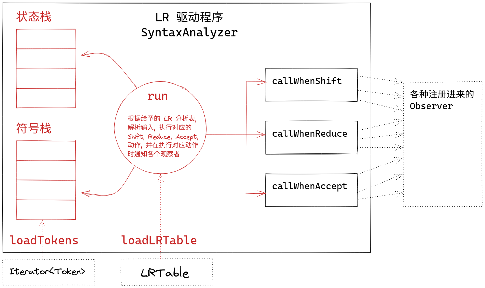

# 实验二：语法分析

## 实验概述

### 实验目的

实现一个通用的 LR 语法分析驱动程序。

它可以读入词法单元类别，任意的语法以及与之匹配的任意的 LR 分析表，随后读入词法单元流，依次根据分析表与语法执行移入、规约、接受、报错动作，并在前三种动作执行时调用注册到其上的观察者的对应方法。



### 输入/输出

程序读入下面的文件

```
data/in
├── coding_map.csv      # 码点文件
├── grammar.txt         # 语法文件
├── input_code.txt      # 输入代码
└── LR1_table.csv       # (可选) 第三方工具生成的 IR 分析表
```

生成下面的文件

```
data/out
├── parser_list.txt         # 规约过程的产生式列表
├── old_symbol_table.txt    # 语义分析前的符号表
└── token.txt               # 词法单元流
```

`data/std` 目录下存放同名的参考文件

## 框架介绍

### LRTable: LR 分析表

由动作表 ``action`` 表与转移表 ``goto`` 表组成，在当前状态遇到某符号时，根据表中信息，执行动作并转移状态。

``action`` 表项指明当某一栈顶状态，读入某输入符号时分析器应执行的动作，可能的动作包括：移进、归约、接受、报错。

``goto`` 表项指明当某一栈顶状态，分析器刚刚归约出某一语法变量后将转向的下一状态。

 ``LRTable`` 中提供了访问动作和转移的接口

```java
class LRTable {
    /**
     * 根据当前状态与当前词法单元获取对应动作
     * @param status 当前状态
     * @param token 当前词法单元
     * @return 应采取的动作
     */
    public Action getAction(Status status, Token token) {
        final var tokenKind = token.getKind();
        return status.getAction(tokenKind);
    }

    /**
     * 根据当前状态与规约到非终结符获得应转移到的状态
     * @param status 当前状态
     * @param nonTerminal 规约出的非终结符
     * @return 应转移到的状态
     */
    public Status getGoto(Status status, NonTerminal nonTerminal) {
        return status.getGoto(nonTerminal);
    }

    /**
     * @return 起始状态
     */
    public Status getInit() {
        // return initStatus;
        return statusInIndexOrder.get(0);
    }
}

```

理论上一个 ``LRTable`` 只需要保存起始状态 (``initStatus``) 即可。为了方便将整个表输出为 ``.csv`` 查看， ``LRTable`` 中保存了一些多余的状态，但 **不应该** 使用这些信息：

```java
class LRTable {
    private final List<Status> statusInIndexOrder;
    private final List<TokenKind> terminals;
    private final List<NonTerminal> nonTerminals;
}
```

### Status: 状态

一个状态由 ``action`` 和 ``goto`` 组成，它们的语义如下：

- ``action``: 在当前状态下遇到某个终结符需要采取什么动作
- ``goto``: 在当前状态下遇到（规约到）某个非终结符需要转移到什么状态

为了节省内存空间，表中并不会储存对应错误动作/错误状态的值。

我们并不采用整数来代表状态，而是直接使用状态自身来代表它自身（即 Java 对象引用）。

```java
class Status {
    private Map<TokenKind, Action> action;
    private Map<NonTerminal, Status> goto_;     // goto 是 Java 保留关键字, 故尾附一下划线
}
```

获取这些信息可采用 ``getAction`` 与 ``getGoto`` 方法

```java
class Status {
    public Action getAction(TokenKind terminal) {
        return action.getOrDefault(terminal, Action.error());
    }

    public Action getAction(Token token) {
        return getAction(token.getKind());
    }

    public Status getGoto(NonTerminal nonTerminal) {
        return goto_.getOrDefault(nonTerminal, Status.error());
    }
}
```

### Action: 动作

LR 分析中的动作有四种，动作的类别使用一枚举来表示，同时还有一些特殊的动作独有的成分

```java
enum ActionKind {
    Shift,      // 移入
    Reduce,     // 规约
    Accept,     // 接受
    Error,      // 出错
}

class Action {
    private ActionKind kind;
    private Production production;  // 当且仅当动作为规约时它非空
    private Status status;          // 当且仅当动作为移入时它非空
}
```

应当采用各个访问方法来访问这些信息，这些访问性方法会检查动作类别并确定返回值非空

```java
class Action {
    public ActionKind getKind() {
        return kind;
    }

    public Production getProduction() {
        if (kind != ActionKind.Reduce) {
            throw new RuntimeException("Only reduce action could have a production");
        }

        assert production != null;
        return production;
    }

    public Status getStatus() {
        if (kind != ActionKind.Shift) {
            throw new RuntimeException("Only shift action could hava a status");
        }

        assert status != null;
        return status;
    }
}
```

参考如下代码片段对动作进行分类：

```java
switch (action.getKind()) {
    case Shift -> {
        final var shiftTo = action.getStatus();
        // ...
    }

    case Reduce -> {
        final var production = action.getProduction();
        // ...
    }

    case Accept -> {
        // ...
    }

    case Error -> {
        // ...
    }
}
```

## 代码设计

### 语法分析器: SyntaxAnalyzer

该程序接受词法单元串与 LR 分析表，对词法单元流进行分析，查LR分析表执行对应动作，并在执行动作时通知各注册的观察者。

```java
public class SyntaxAnalyzer {
    private final SymbolTable symbolTable;
    private final List<ActionObserver> observers = new ArrayList<>();
	// 词法单元串与 LR 分析表
    private Iterator<Token> tokens;
    private LRTable table;
}
```

#### 加载词法单元: loadTokens

直接创建迭代器

```java
public void loadTokens(Iterable<Token> tokens) {
    this.tokens = tokens.iterator();
}
```

#### 加载LR 分析表: loadLRTable

直接存入 ``LRTable``

```java
public void loadLRTable(LRTable table) {
    this.table = table;
}
```

#### 符号类: Symbol

为将 `Token` 和 `NonTerminal` 同时装在栈中，简单定义一个 ``Symbol`` 来实现 ``Union<Token, NonTerminal>`` 的功能，其实现方式参照指导书。

```java
class Symbol{
    Token token;
    NonTerminal nonTerminal;

    private Symbol(Token token, NonTerminal nonTerminal){
        this.token = token;
        this.nonTerminal = nonTerminal;
    }

    public Symbol(Token token){
        this(token, null);
    }

    public Symbol(NonTerminal nonTerminal){
        this(null, nonTerminal);
    }

    public boolean isToken(){
        return this.token != null;
    }

    public boolean isNonterminal(){
        return this.nonTerminal != null;
    }
}
```

#### 语法分析过程: run

定义符号栈与状态栈，添加初始状态 ``(S0,eof)`` 。

输入符号存储于迭代器 ``tokens`` ，每次根据当前输入符号与栈顶状态，通过查 ``action`` 表获取动作。

移进：将输入符号与该动作的状态压入栈，表示读入符号并转移状态。

归约：根据动作对应产生式进行规约，弹出产生式右部的符号与状态对，然后将产生式左部符号压入符号栈，根据当前栈顶状态与产生式归约出的非终结符，查 ``goto`` 表所得状态压入符号栈。

接受：分析成功，退出。

报错：直接退出。

以上情况除报错外均需调用对应 ``call...`` 方法，以通知各观察者，以进行语义分析与IR生成。

```java
public void run() {
        // 分别在遇到 Shift, Reduce, Accept 的时候调用上面的 callWhenInShift, callWhenInReduce, callWhenInAccept

        // 符号栈
        Stack<Symbol> symbolStack = new Stack<>();
        // 状态栈
        Stack<Status> statusStack = new Stack<>();
        // 初始状态为(S0,eof)
        symbolStack.push(new Symbol(Token.eof()));
        statusStack.push(table.getInit());

        // 输入符号
        Token token = null;
        // 上一步是否为移位动作标志，初始化为true以读入第一个符号
        boolean isShift = true;
        while (tokens.hasNext() || !symbolStack.isEmpty()) {
            // 当前输入符号
            if(isShift){
                token = tokens.next();
                isShift = false;
            }
            // 根据栈顶元素和输入符号，得到对应动作
            Action action = table.getAction(statusStack.peek(),token);
            // 执行不同动作
            switch (action.getKind()){
                // 移进
                case Shift -> {
                    // 移进动作的状态
                    Status actionStatus = action.getStatus();
                    // 将输入符号与状态压入栈
                    symbolStack.push(new Symbol(token));
                    statusStack.push(actionStatus);
                    // 移进动作
                    callWhenInShift(actionStatus, token);
                    isShift = true;
                }
                // 归约
                case Reduce -> {
                    // 进行归约的产生式
                    Production production = action.getProduction();
                    // 将产生式右部的若干符号弹出
                    for(int i=0; i<production.body().size(); i++){
                        symbolStack.pop();
                        statusStack.pop();
                    }
                    // 再压入归约的产生式左部的符号
                    symbolStack.push(new Symbol(production.head()));
                    // 根据此时栈顶状态和归约得到的非终结符，得到将转移的状态并压入栈
                    statusStack.push(table.getGoto(statusStack.peek(), production.head()));
                    // 归约动作
                    callWhenInReduce(statusStack.peek(), production);
                }
                // 接受
                case Accept -> {
                    // 接受动作
                    callWhenInAccept(statusStack.peek());
                    return;
                }
                // 报错
                case Error -> {
                    return;
                }
            }
        }
    }
```
