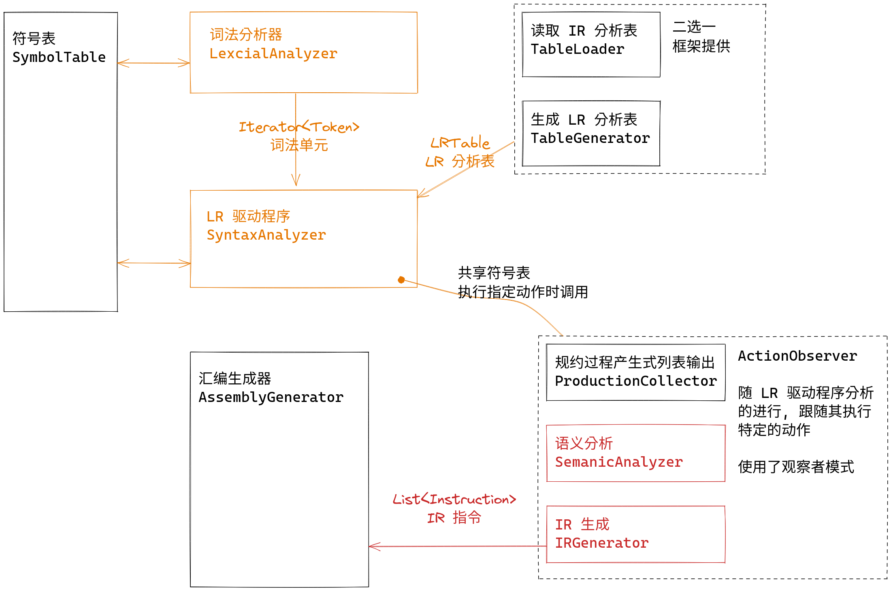
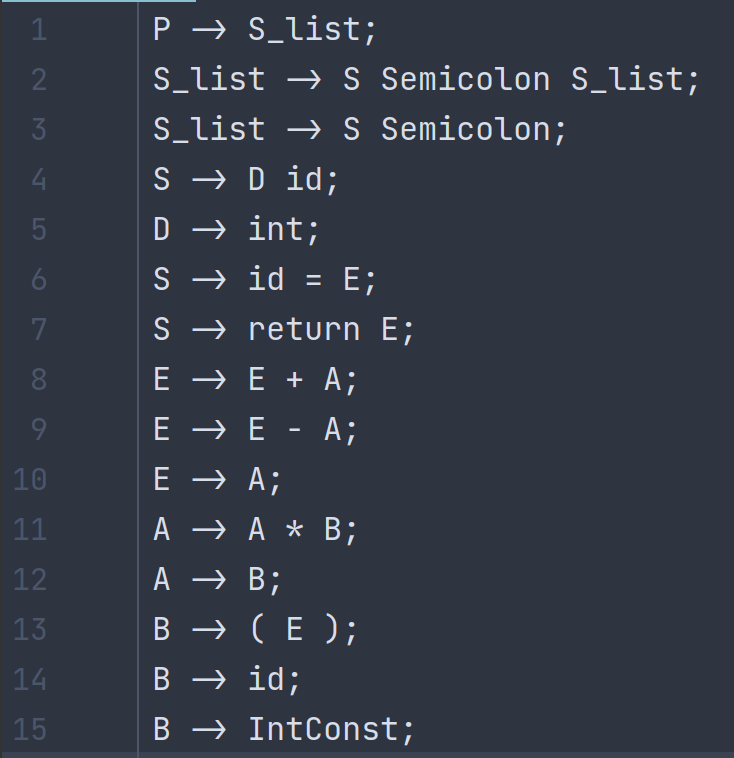

# 实验三：语义分析与IR生成

## 实验概述



本次实验将要完成 SDT 风格的语义分析与 IR 生成。

### 输入输出

程序读入下面的文件

```
data/in
├── coding_map.csv      # 码点文件
├── grammar.txt         # 语法文件
├── input_code.txt      # 输入代码
└── LR1_table.csv       # (可选) 第三方工具生成的 IR 分析表
```

生成下面的文件

```
data/out
├── intermediate_code.txt   # 中间表示
├── ir_emulate_result.txt   # 中间表示的模拟执行的结果
├── parser_list.txt         # 规约过程的产生式列表
├── new_symbol_table.txt    # 语义分析后的符号表
├── old_symbol_table.txt    # 语义分析前的符号表
└── token.txt               # 词法单元流
```

`data/std` 目录下存放同名的参考文件

## 框架介绍

### IR相关API

#### IR 中的值: ``IRValue`` , ``IRVariable`` , ``IRImmediate`` 

 ``IRValue`` 代表所有能作为 IR 指令的参数的事物。

立即数和变量作为指令的参数，实现为 ``IRImmidiate`` 和 ``IRVariable``

```java
interface IRValue {}

class IRImmediate implements IRValue {
    private int value;
}

class IRVariable implements IRValue {
    private String name;
}
```

其中 ``IRVariable`` 的 ``name`` 一般不要求有什么意义，只是拿来区分各个 ``IRVariable`` 的罢了。但实践上我们一般会把源代码中的一些信息也记载到 IR 上，方便调试和观察。所以我们允许在构造 ``IRVariable`` 的时候为它指定一个名字，这样你就可以清楚地看到该 ``IRVariable`` 在翻译时是对应了源语言中的哪个变量。当然你也可以完全不管，所有变量都用默认名称了事。

```java
class IRVariable {
    // 构造一个具有附加名称 `name` 的 IR 变量
    public static IRVariable named(String name);

    // 构造一个具有默认附加名称的 IR 变量
    public static IRVariable temp();    
}
```

#### IR 中的指令: ``Instruction``

```java
enum InstructionKind {
    MOV, ADD, SUB, MUL, RET
}

class Instruction {
    private InstructionKind kind;
    private IRVariable result;          // nullable, if instruction has no result
    private List<IRValue> operands;
}
```

鉴于在一个编译器里，IR 的种类是固定的，我们直接采用枚举来标志 IR 种类并自行在各个 getter 中判断对该种类的操作是否合法，而不是采用 ``Instruction`` 父类， ``BinaryInstruction`` ， ``UnaryInstruction`` ，... 子类这种继承实现。因为编译器中充斥“对不同种类的指令采取不同操作”这种行为，如果要使用继承的话，那么就只能在下面三种方法中选择：

*     采用大量的 if instanceof （模式匹配的 switch 在 Java 17 LTS 还是 preview 特性，不能用），而这众所周知是强烈违反 OOP 原则的
*     将不同的操作作为 IR 的方法，然后每个子类 Override。这样的缺点是会在 IR 这种理应独立的数据结构中加入过多的其他部分的代码。
*     实现一个 IRVisitor，但是对于我们这种项目而言太过小题大做了。

说白了，IR 作为一种“对象种类确定，操作不确定”的东西，天然不适合用 OOP 处理。（除非你将“操作”视为对象，这就直接是 Visitor 模式了。）那不如直接怎么写死怎么来，用枚举确定类型，用 getter 包装不同类型的不同参数的访问，用 createXXX 方法模拟子类构造函数。

虽然不同类别的 IR 指令内部结构一致, 但它们显然有不同的构造方式与不同的组成部分。具体而言：

- ``MOV``, ``RET`` 指令只有一个参数
- ``ADD``, ``SUB``, ``MUL`` 指令有两个参数
- ``RET`` 指令没有结果

为了更好地构造指令与访问指令中的具体成分，我们提供了一些辅助方法。

##### 构造

不同类别的指令对应接受不同参数的的静态构造函数：

```java
class Instruction {
    public static Instruction createMov(IRVariable result, IRValue from);
    public static Instruction createAdd(IRVariable result, IRValue lhs, IRValue rhs);
    public static Instruction createSub(IRVariable result, IRValue lhs, IRValue rhs);
    public static Instruction createMul(IRVariable result, IRValue lhs, IRValue rhs);
    public static Instruction createRet(IRValue returnValue);
}
```

##### 访问

对任意指令的两个通用访问方法：（对于 ``RET`` 而言， ``getResult`` 并不能使用）

```java
class Instruction {
    public IRVariable getResult();
    public List<IRValue> getOperands();
}
```

与静态构造函数参数名称对应的域的获取方法：

```java
class Instruction {
    public IRValue getFrom();
    public IRValue getLHS();
    public IRValue getRHS();
    public IRValue getReturnValue();
}
```

当你试图访问一个对当前指令而言不存在的域的时候，它会抛出 ``RuntimeException`` 。

各方法允许调用的指令类别如下：

- ``getResult``: ``MOV``, ``ADD``, ``SUB``, ``MUL``
- ``getFrom``: ``MOV``
- ``getLHS``, ``getRHS``: ``ADD``, ``SUB``, ``MUL``
- ``getReturnValue``: ``RET``

或者反查表：

- ``MOV``: ``getResult``, ``getFrom``
- ``ADD``, ``SUB``, ``MUL``: ``getResult``, ``getLHS``, ``getRHS``
- ``RET``: ``getReturnValue``

### 语法文件相关 API

#### ``Production``: 产生式

一个产生式由下面的三部份组成：

```java
class Production {
    // 用来唯一标识该产生式的索引
    private int index;
    // 产生式头
    private NonTerminal head;
    // 产生式体
    private List<Term> body;
}
```

如下图，当你使用任何支持显示行号的软件打开 ``grammar.txt`` 时，你就能方便地确定每条产生式的 ``index`` ：



此时 ``P -> S_list`` 的 ``index`` 便是 ``1`` ， ``S -> D id`` 的 ``index`` 便是 ``4`` ，如此类推。

``index`` 的存在主要是为了方便在 ``ActionObserver#whenReduce`` 方法中根据规约到的产生式进行不同的动作，你可以参考下面的写法：

```java
class ThisIsAClass implements ActionObserver {
    @Override
    public void whenReduce(Status currentStatus, Production production) {
        switch (production.index()) {
            // 我们推荐在 case 后面使用注释标明产生式
            // 这样能比较清楚地看出产生式索引与产生式的对应关系
            case 1 -> { // P -> S_list
                /* ... */
            }

            case 4 -> { // S -> D id 
                /* ... */
            }

            case 5 -> { // D -> int
                /* ... */
            }
            // ...
            default -> { // 
                // throw new RuntimeException("Unknown production index");
                // 或者任何默认行为
            }
        }
    }
}
```

#### ``Term``, ``NonTerminal``, ``TokenKind``: 各类文法符号

``Term`` 代表一个文法符号，可以是终止符也可以是非终止符。

 ``name`` 被设计为用于表示这个文法符号的名字，比如对于非终结符 ``P`` ，它的 ``name`` 就是 ``"P"`` 。

```java
abstract class Term {
    private String name;
}
```

非终结符的实现非常简单：它什么都不用存，只需要有一个构造函数即可。

```java
class NonTerminal extends Term {}
```

终止符直接使用了 ``TokenKind`` ：

```java
class TokenKind extends Term {}
```

## 代码设计

### 符号类: Symbol

同实验2，其目的为实现 ``Union<Token, NonTerminal>``。

```java
public class Symbol {
    Token token;
    NonTerminal nonTerminal;

    private Symbol(Token token, NonTerminal nonTerminal){
        this.token = token;
        this.nonTerminal = nonTerminal;
    }

    public Symbol(Token token){
        this(token, null);
    }

    public Symbol(NonTerminal nonTerminal){
        this(null, nonTerminal);
    }

    public boolean isToken(){
        return this.token != null;
    }

    public boolean isNonterminal(){
        return this.nonTerminal != null;
    }
}
```

### 语义分析器: SemanticAnalyzer

语义分析栈由符号栈和属性栈组成，两者同步进栈出栈。

（一种优化方式是将二者组成元组构建新的类，这样只需使用一个栈即可）

```java
public class SemanticAnalyzer implements ActionObserver {

    private SymbolTable symbolTable = null;
    
	// 语义分析栈
    Stack<Symbol> symbolStack = new Stack<>();
    Stack<SourceCodeType> typeStack = new Stack<>();
}
```

#### 接受动作: whenAccept

do nothing

```java
@Override
public void whenAccept(Status currentStatus) {
    //  该过程在遇到 Accept 时要采取的代码动作

}
```

#### 归约动作: whenReduce

将产生式体所有符号出栈。

在遇到 ``index`` 4和5的产生式时修改相应符号的 ``type``。

然后将产生式头入栈。其中属性栈压入 ``null`` 时表示占位。

```java
@Override
public void whenReduce(Status currentStatus, Production production) {
    // 该过程在遇到 reduce production 时要采取的代码动作
    switch (production.index()) {
            // 我们推荐在 case 后面使用注释标明产生式
            // 这样能比较清楚地看出产生式索引与产生式的对应关系
        case 4 -> { // S -> D id
            // 查找id并修改其type为D对应type
            Symbol id = symbolStack.pop();
            Symbol D = symbolStack.pop();
            SourceCodeType idType = typeStack.pop();
            SourceCodeType DType = typeStack.pop();

            String text = id.token.getText();
            if(symbolTable.has(text)){
                symbolTable.get(text).setType(DType);
            } else {
                throw new RuntimeException("SymbolTable no such id");
            }
            // 压入S type为空
            //symbolStack.push(new Symbol(production.head()));
            typeStack.push(null);
        }
        case 5 -> { // D -> int
            symbolStack.pop();
            typeStack.pop();
            // 压入D type为int
            //symbolStack.push(new Symbol(production.head()));
            typeStack.push(SourceCodeType.Int);
        }
        default -> {
            if(production.index() < 1 || production.index() > 15){
                throw new RuntimeException("Illegal production index");
            }
            for (int i = 1; i < production.body().size(); i++) {
                symbolStack.pop();
                typeStack.pop();
            }
            // 压入其他产生式头 type为空
            //symbolStack.push(new Symbol(production.head()));
            typeStack.push(null);
        }
    }
    symbolStack.push(new Symbol(production.head()));
}
```

#### 移进动作: whenShift

将输入符号压栈， ``type`` 设置为 ``null``。

```java
@Override
public void whenShift(Status currentStatus, Token currentToken) {
    // 该过程在遇到 shift 时要采取的代码动作

    // 将token入栈，type初始为空
    symbolStack.push(new Symbol(currentToken));
    typeStack.push(null);
}
```

### IR生成器: IRGenerator

语义分析栈由符号栈和 ``IRValue`` 栈组成，两者同步进栈出栈。

```java
public class IRGenerator implements ActionObserver {

    private SymbolTable symbolTable = null;

    // 语义分析栈
    private final Stack<Symbol> symbolStack = new Stack<>();
    private final Stack<IRValue> irValueStack = new Stack<>();
    // 生成代码列表
    private final List<Instruction> instList = new LinkedList<>();
}
```

#### 接受动作: whenAccept

do nothing

```java
@Override
public void whenAccept(Status currentStatus) {

}
```

#### 归约动作: whenReduce

将产生式体所有符号出栈。

根据当前产生式生成相应中间代码或

然后将产生式头入栈。其中 ``IRValue`` 栈压入 ``null`` 时表示占位。

```java
@Override
public void whenReduce(Status currentStatus, Production production) {
    // 根据归约的产生式进行不同操作
    switch (production.index()) {
        case 6 -> { // S -> id = E;
            symbolStack.pop();
            symbolStack.pop();
            Symbol id = symbolStack.pop();
            IRValue EValue = irValueStack.pop();
            irValueStack.pop();
            irValueStack.pop();

            // id为具体变量
            String text = id.token.getText();
            if(!symbolTable.has(text)){
                throw new RuntimeException("SymbolTable no such id");
            }
            IRVariable idValue = IRVariable.named(text);
            // MOV id E
            instList.add(Instruction.createMov(idValue, EValue));

            // 压入S value为null
            //symbolStack.push(new Symbol(production.head()));
            irValueStack.push(null);
        }
        case 7 -> { // S -> return E;
            symbolStack.pop();
            symbolStack.pop();
            IRValue EValue = irValueStack.pop();
            irValueStack.pop();

            // RET E
            instList.add(Instruction.createRet(EValue));

            // 压入S value为null
            //symbolStack.push(new Symbol(production.head()));
            irValueStack.push(null);
        }
        case 8 -> { // E -> E + A
            symbolStack.pop();
            symbolStack.pop();
            symbolStack.pop();
            IRValue AValue = irValueStack.pop();
            irValueStack.pop();
            IRValue EValue = irValueStack.pop();

            // 计算结果为临时变量
            IRVariable temp = IRVariable.temp();
            // ADD E A
            instList.add(Instruction.createAdd(temp, EValue, AValue));

            // 压入E value为temp
            //symbolStack.push(new Symbol(production.head()));
            irValueStack.push(temp);
        }
        case 9 -> { // E -> E - A;
            symbolStack.pop();
            symbolStack.pop();
            symbolStack.pop();
            IRValue AValue = irValueStack.pop();
            irValueStack.pop();
            IRValue EValue = irValueStack.pop();

            // 计算结果为临时变量
            IRVariable temp = IRVariable.temp();
            // SUB E A
            instList.add(Instruction.createSub(temp, EValue, AValue));

            // 压入E value为temp
            //symbolStack.push(new Symbol(production.head()));
            irValueStack.push(temp);
        }
        case 10 -> { // E -> A;
            symbolStack.pop();
            IRValue AValue = irValueStack.pop();

            // 压入E value为A的value
            //symbolStack.push(new Symbol(production.head()));
            irValueStack.push(AValue);
        }
        case 11 -> { // A -> A * B;
            symbolStack.pop();
            symbolStack.pop();
            symbolStack.pop();
            IRValue BValue = irValueStack.pop();
            irValueStack.pop();
            IRValue AValue = irValueStack.pop();

            // 计算结果为临时变量
            IRVariable temp = IRVariable.temp();
            // MUL A B
            instList.add(Instruction.createMul(temp, AValue, BValue));

            // 压回E
            //symbolStack.push(new Symbol(production.head()));
            irValueStack.push(temp);
        }

        case 12 -> { // A -> B;
            symbolStack.pop();
            IRValue BValue = irValueStack.pop();

            // 压入A value为B的value
            //symbolStack.push(new Symbol(production.head()));
            irValueStack.push(BValue);
        }
        case 13 -> { // B -> ( E );
            symbolStack.pop();
            symbolStack.pop();
            symbolStack.pop();
            irValueStack.pop();
            IRValue EValue = irValueStack.pop();
            irValueStack.pop();

            // 压入B value为E的value
            //symbolStack.push(new Symbol(production.head()));
            irValueStack.push(EValue);
        }
        case 14 -> { // B -> id;
            Symbol id = symbolStack.pop();
            irValueStack.pop();

            // B为具体变量
            String text = id.token.getText();
            if(!symbolTable.has(text)){
                throw new RuntimeException("SymbolTable no such id");
            }
            IRVariable BValue = IRVariable.named(text);

            // 压入B value为named具体变量
            //symbolStack.push(new Symbol(production.head()));
            irValueStack.push(BValue);
        }
        case 15 -> { // B -> IntConst;
            Symbol IntConst = symbolStack.pop();
            irValueStack.pop();


            // B为立即数
            String text = IntConst.token.getText();
            IRImmediate BValue = IRImmediate.of(Integer.parseInt(text));

            // 压入B value为immediate立即数
            //symbolStack.push(new Symbol(production.head()));
            irValueStack.push(BValue);
        }
        default -> {
            for (int i = 1; i < production.body().size(); i++) {
                symbolStack.pop();
                irValueStack.pop();
            }

            // 压入其他产生式头 value为空
            //symbolStack.push(new Symbol(production.head()));
            irValueStack.push(null);
        }
    }
    symbolStack.push(new Symbol(production.head()));
}
```

#### 移进动作: whenShift

将输入符号压栈， ``irValue`` 设置为 ``null``。

```java
@Override
public void whenShift(Status currentStatus, Token currentToken) {
symbolStack.push(new Symbol(currentToken));
irValueStack.push(null);
}
```

#### 返回IR: getIR

```java
public List<Instruction> getIR() {
    return instList;
}
```
