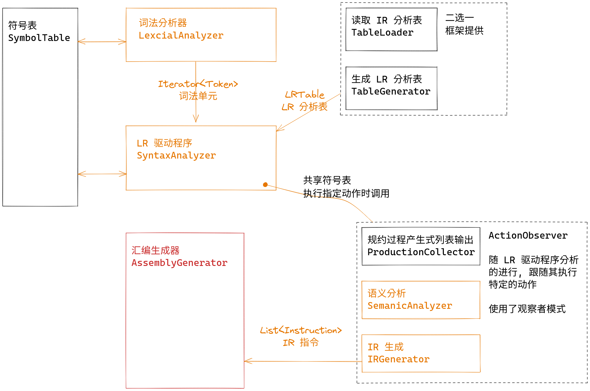

# 实验四：汇编生成

## 实验概述



本次实验将要完成汇编代码生成与寄存器分配。目标平台为支持 RV32M 的 riscv32 机器。

### 所需的 RV32M 指令

参考

- [RV32I](http://riscvbook.com/chinese/RISC-V-Reader-Chinese-v2p1.pdf#[{"num"%3A77%2C"gen"%3A0}%2C{"name"%3A"XYZ"}%2C115%2C769%2C0])
- [RV32M](http://riscvbook.com/chinese/RISC-V-Reader-Chinese-v2p1.pdf#[{"num"%3A127%2C"gen"%3A0}%2C{"name"%3A"XYZ"}%2C115%2C769%2C0])

RV32M 向 RV32I 添加了整数乘法和整数除法的指令。

| 指令                  | 含义       |
| :-------------------- | :--------- |
| `add rd, rs1, rs2`    | 寄存器加法 |
| `sub rd, rs1, rs2`    | 寄存器减法 |
| `mul rd, rs1, rs2`    | 寄存器乘法 |
| `addi rd, rs1, imm`   | 立即数加法 |
| `subi rd, rs1, imm`   | 立即数减法 |
| `lw rd, offset(rs1)`  | 内存读     |
| `sw rs2, offset(rs1)` | 内存写     |

同时有一些可能会用到的伪指令。

| 伪指令       | 含义             |
| :----------- | :--------------- |
| `mv rd, rs`  | `addi rd, rs, 0` |
| `neg rd, rs` | `sub rd, x0, rs` |
| `li rd, imm` | 加载立即数       |

### 寄存器约定

根据 [RISC-V 的函数调用规范](http://riscvbook.com/chinese/RISC-V-Reader-Chinese-v2p1.pdf#[{"num"%3A107%2C"gen"%3A0}%2C{"name"%3A"XYZ"}%2C115%2C225%2C0])，我们在代码生成时 **只** 使用 Caller 保存的 ``t0`` 到 ``t6`` ，亦即 ``x5-x7``， ``x28-x31`` 作为汇编代码中任意使用的寄存器。

使用 ``a0`` ，亦即 ``x10`` 作为程序的返回值。

并且我们使用 ``CompactDataAtZero`` 选项规定 data 的开始地址为 0x0。

通过 RARS 我们可以这样进行汇编程序的执行并以十进制形式输出 a0 的值:

```
$ java -jar rars.jar mc CompactDataAtZero a0 nc dec ae255 riscv1.asm

Program terminated by dropping off the bottom.
a0  10945
```

在程序执行后的 ``a0`` 值应为返回值。

### 输入/输出

程序读入下面的文件

```
data/in
├── coding_map.csv      # 码点文件
├── grammar.txt         # 语法文件
├── input_code.txt      # 输入代码
├── LR1_table.csv       # (可选) 第三方工具生成的 IR 分析表
└── reg-alloc.txt       # (可选) 用于测试寄存器分配的样例
```

生成下面的文件

```
data/out
├── assembly_language.asm   # 汇编代码
├── intermediate_code.txt   # 中间表示
├── ir_emulate_result.txt   # 中间表示的模拟执行的结果
├── parser_list.txt         # 规约过程的产生式列表
├── new_symbol_table.txt    # 语义分析后的符号表
├── old_symbol_table.txt    # 语义分析前的符号表
└── token.txt               # 词法单元流
```

``data/std`` 目录下存放同名的参考文件

## 框架介绍

给出的框架代码以及下面列出的 api 均相当少，是由于根据实现的难度不同，写出的代码可能大相径庭。

为保证实现上的自由，只给出与前端的参数传递 api 以及 Main 对此模块的调用相关 api。

### 前端传参

见IR相关API

### 模块调用

见框架代码中的文档注释

## 代码设计

### 双射Map: Bmap

实现参考指导书

```java
public class BMap<K, V> {
    private final Map<K, V> KVmap = new HashMap<>();
    private final Map<V, K> VKmap = new HashMap<>();

    public void removeByKey(K key) {
        VKmap.remove(KVmap.remove(key));
    }

    public void removeByValue(V value) {
        KVmap.remove(VKmap.remove(value));

    }

    public boolean containsKey(K key) {
        return KVmap.containsKey(key);
    }

    public boolean containsValue(V value) {
        return VKmap.containsKey(value);
    }

    public void replace(K key, V value) {
        // 对于双射关系, 将会删除交叉项
        removeByKey(key);
        removeByValue(value);
        KVmap.put(key, value);
        VKmap.put(value, key);
    }

    public V getByKey(K key) {
        return KVmap.get(key);
    }

    public K getByValue(V value) {
        return VKmap.get(value);
    }
}
```

### 汇编生成器: AssemblyGenerator

```java
public class AssemblyGenerator {
    // 预处理后指令列表
    List<Instruction> instList = new LinkedList<>();
    // 变量与寄存器双向map
    BMap<IRValue, Register> variableMap = new BMap<>();
    // 汇编代码，初始化第一行为 ".text"
    List<String> sentences = new ArrayList<>(List.of(".text"));
    // 可以分配的寄存器号
    enum Register {
        t0,t1,t2,t3,t4,t5,t6
    }
}
```

#### 分配寄存器: addVariable

对于传入的操作数，仅当其为当前未存入的变量时，尝试寻找空闲寄存器，若无则寻找后续不再使用的变量占用的寄存器并为其分配。

若无法分配寄存器则什么也不做。

```java
public void addVariable(IRValue operand, int instIndex){
    // 立即数无需分配寄存器
    if (operand.isImmediate()) {
        return;
    }
    // 已存入变量，无需再分配
    if (variableMap.containsKey(operand)) {
        return;
    }
    // 未存入，先寻找空闲寄存器
    for (Register reg : Register.values()) {
        if(!variableMap.containsValue(reg)){
            variableMap.replace(operand,reg);
            return;
        }
    }
    // 若均不空闲，寻找后续不再使用的变量占用的寄存器
    Set<Register> cleanableRegs = Arrays.stream(Register.values()).collect(Collectors.toSet());
    for(int i = instIndex; i<instList.size(); i++){
        // 排除后续每一条指令所有出现的变量所占用的寄存器（若存在），剩余即为可被清理的寄存器
        Instruction inst = instList.get(i);
        for(IRValue irValue : inst.getOperands()){
            Register reg = variableMap.getByKey(irValue);
            cleanableRegs.remove(reg);
        }
    }
    // 存在可清理寄存器则将其分配
    if(!cleanableRegs.isEmpty()) {
        variableMap.replace(operand,cleanableRegs.iterator().next());
    }
}
```

#### 加载中间代码: loadIR

对原始中间代码进行预处理如下

对于两个操作数的指令，即 ``ADD`` ``SUB`` ``MUL`` ：

- 操作两个立即数的指令直接求得其结果并将其替换为 ``MOV`` 指令
- 操作一个立即数的乘法和左立即数减法前插入一条 ``MOV a imm`` 指令，用``a`` 替换原立即数
- 将左立即数加法交换两操作数变为右立即数

对于一个操作数的指令，当遇到``RET`` 时直接舍弃后续指令。

```java
public void loadIR(List<Instruction> originInstructions) {
    for (Instruction inst : originInstructions) {
        switch (inst.getKind()) {
                // 两个操作数的指令
            case ADD,SUB,MUL -> {
                // 预处理操作数有立即数的指令
                boolean lhsIsImm = inst.getLHS().isImmediate();
                boolean rhsIsImm = inst.getRHS().isImmediate();
                if (lhsIsImm && rhsIsImm) {
                    // 两个立即数直接求值得到结果
                    InstructionKind kind = inst.getKind();
                    int l = ((IRImmediate)inst.getLHS()).getValue();
                    int r = ((IRImmediate)inst.getRHS()).getValue();
                    int res = switch (kind) {
                        case ADD -> l + r;
                        case SUB -> l - r;
                        case MUL -> l * r;
                        default -> 0;
                    };
                    IRImmediate tmp = IRImmediate.of(res);
                    instList.add(Instruction.createMov(inst.getResult(),tmp));
                } else if (lhsIsImm && !rhsIsImm) {
                    // 左立即数修改指令
                    switch (inst.getKind()) {
                            // 加法交换左立即数至右边
                        case ADD -> instList.add(Instruction.createAdd(inst.getResult(),inst.getRHS(),inst.getLHS()));
                            // 减法与乘法指令前添加 MOV tmp imm
                        case SUB -> {
                            IRVariable tmp = IRVariable.temp();
                            instList.add(Instruction.createMov(tmp,inst.getLHS()));
                            instList.add(Instruction.createSub(inst.getResult(),tmp,inst.getRHS()));
                        }
                        case MUL -> {
                            IRVariable tmp = IRVariable.temp();
                            instList.add(Instruction.createMov(tmp,inst.getLHS()));
                            instList.add(Instruction.createMul(inst.getResult(),tmp,inst.getLHS()));
                        }
                        default -> instList.add(inst);
                    }
                } else if (!lhsIsImm && rhsIsImm) {
                    // 右立即数修改指令
                    // 乘法指令前添加 MOV tmp IMM
                    if (inst.getKind() == InstructionKind.MUL) {
                        IRVariable tmp = IRVariable.temp();
                        instList.add(Instruction.createMov(tmp,inst.getLHS()));
                        instList.add(Instruction.createMul(inst.getResult(),tmp,inst.getLHS()));
                    } else {
                        instList.add(inst);
                    }
                } else {
                    // 两个操作数均不为立即数，无需处理
                    instList.add(inst);
                }
            }
                // 一个操作数的指令
            case RET -> {
                // 遇到RET指令后直接舍弃后续指令
                instList.add(inst);
                return;
            }
            case MOV -> instList.add(inst);
        }
    }
}
```

#### 代码生成过程: run

对预处理后的中间代码，首先为每条指令的所有变量分配寄存器

- 对 ``ADD`` ``SUB`` ，考虑其右操作数是否为立即数，对应生成寄存器运算或立即数运算代码
- 对 ``MUL`` ，直接生成寄存器乘法代码
- 对 ``MOV`` ，考虑其右操作数是否为立即数，对应生成加载立即数或``mv`` 伪指令
- 对 ``RET`` ，生成 ``mv a0 __`` ，然后退出舍弃后续指令

```java
public void run() {
    // 执行寄存器分配与代码生成
    for(int i=0;i<instList.size();i++) {
        Instruction inst = instList.get(i);
        String str = null;
        switch (inst.getKind()) {
                // 对ADD SUB MUL，为三个变量分配寄存器（若需要），并根据是否含立即数生成对应汇编代码
            case ADD -> {
                IRValue res = inst.getResult();
                IRValue lhs = inst.getLHS();
                IRValue rhs = inst.getRHS();
                addVariable(res,i);
                addVariable(lhs,i);
                addVariable(rhs,i);
                Register resReg = variableMap.getByKey(res);
                Register lhsReg = variableMap.getByKey(lhs);
                Register rhsReg = variableMap.getByKey(rhs);
                if(rhs.isImmediate()){
                    str = "\taddi %s,%s,%s".formatted(resReg.toString(),lhsReg.toString(),rhs.toString());
                } else {
                    str = "\tadd %s,%s,%s".formatted(resReg.toString(),lhsReg.toString(),rhsReg.toString());
                }
            }
            case SUB -> {
                IRValue res = inst.getResult();
                IRValue lhs = inst.getLHS();
                IRValue rhs = inst.getRHS();
                addVariable(res,i);
                addVariable(lhs,i);
                addVariable(rhs,i);
                Register resReg = variableMap.getByKey(res);
                Register lhsReg = variableMap.getByKey(lhs);
                Register rhsReg = variableMap.getByKey(rhs);
                if(rhs.isImmediate()){
                    str = "\tsubi %s,%s,%s".formatted(resReg.toString(),lhsReg.toString(),rhs.toString());
                } else {
                    str = "\tsub %s,%s,%s".formatted(resReg.toString(),lhsReg.toString(),rhsReg.toString());
                }
            }
            case MUL -> {
                IRValue res = inst.getResult();
                IRValue lhs = inst.getLHS();
                IRValue rhs = inst.getRHS();
                addVariable(res,i);
                addVariable(lhs,i);
                addVariable(rhs,i);
                Register resReg = variableMap.getByKey(res);
                Register lhsReg = variableMap.getByKey(lhs);
                Register rhsReg = variableMap.getByKey(rhs);
                str = "\tmul %s,%s,%s".formatted(resReg.toString(),lhsReg.toString(),rhsReg.toString());
            }
                // 对MOV，为两个变量分配寄存器（若需要）
                // 若第二个操作数为立即数，生成汇编代码为 li（加载立即数），否则为 mv
            case MOV -> {
                IRValue res = inst.getResult();
                IRValue from = inst.getFrom();
                addVariable(res,i);
                addVariable(from,i);
                Register resReg = variableMap.getByKey(res);
                Register fromReg = variableMap.getByKey(from);
                if (from.isImmediate()) {
                    str = "\tli %s,%s".formatted(resReg.toString(),from.toString());
                } else {
                    str = "\tmv %s,%s".formatted(resReg.toString(),fromReg.toString());
                }
            }
                // 对RET，生成汇编代码为 mv a0 __
            case RET -> str = "\tmv a0," + variableMap.getByKey(inst.getReturnValue()).toString();
        }
        // 添加注释，即对应中间代码
        str = str + "\t# %s".formatted(inst.toString());
        sentences.add(str);
        // 读取到RET指令后，直接舍弃后续指令
        if (inst.getKind() == InstructionKind.RET) {
            break;
        }
    }
    System.out.println("Assembly Generate over");
}
```

#### 输出文件: dump

```java
public void dump(String path) {
    // 输出汇编代码到文件
    FileUtils.writeLines(path,sentences.stream().toList());
}
```

